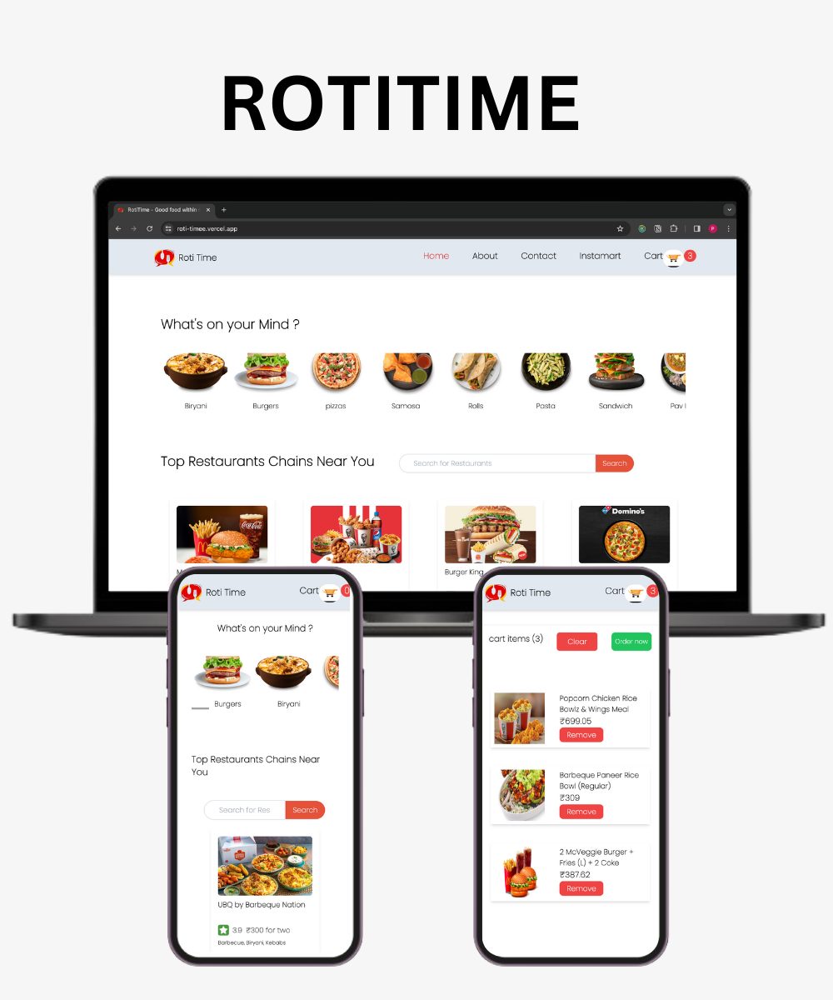

# RotiTime - good food within minutes

[Live Project Link](https://roti-timee.vercel.app/)

### RotiTime is an online food ordering platform. It is built using React, TailwindCSS and Swiggy’s API.

With RotiTime people can easily get restaurants like taste at their home without going out to restaurants and eateries ,
they will get their delicious parcels delivered to doorsteps so that they can enjoy them at their leisure

# Features

- Real-time Swiggy API Integration
- Search for Restaurants
- Detailed Restaurant Information
- Add and Remove items from Cart
- Seamless Navigation enabling users to effortlessly explore different sections
- RotTime's Shimmer UI effect enhancing the overall user experience
- Fully responsive design to ensure compatibility with all devices

# Upcoming Features

- Location Setup : allowing users to seamlessly set and customize their preferred locations for accurate and personalized service
- Login : allowing users to create accounts and access personalized services
- Filtering Options: allowing users to discover restaurants based on specific categories or preferences
- Dark Mode

# Usage

1. Clone the repository `https://github.com/harmostparmod15/RotiTime `
2. Install the dependencies using `npm install`
3. Start the Development server using `npm start`
4. Open your browser and go to ` http://localhost:1234`
